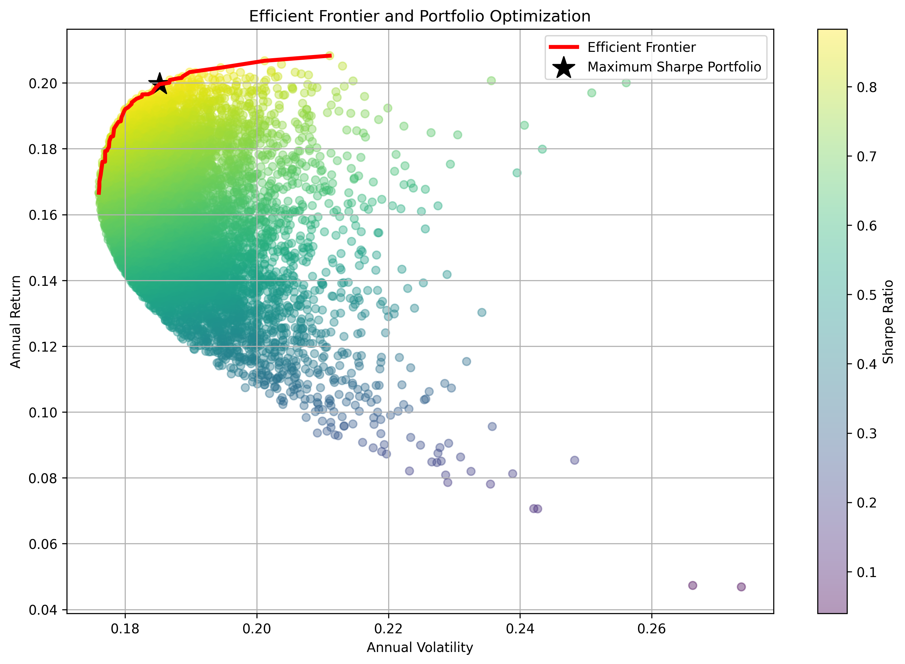
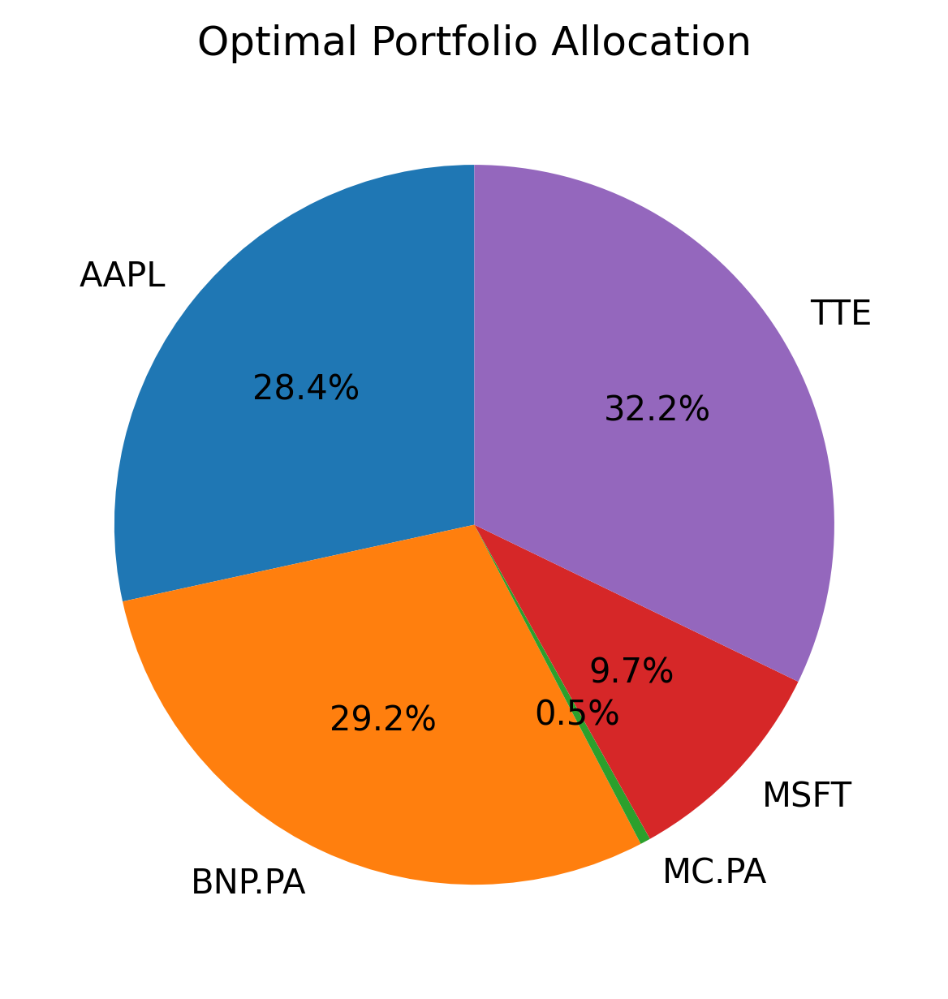
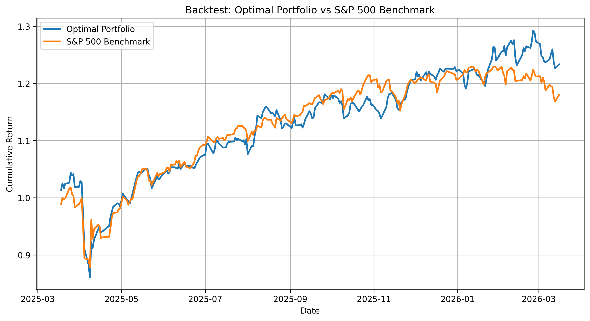
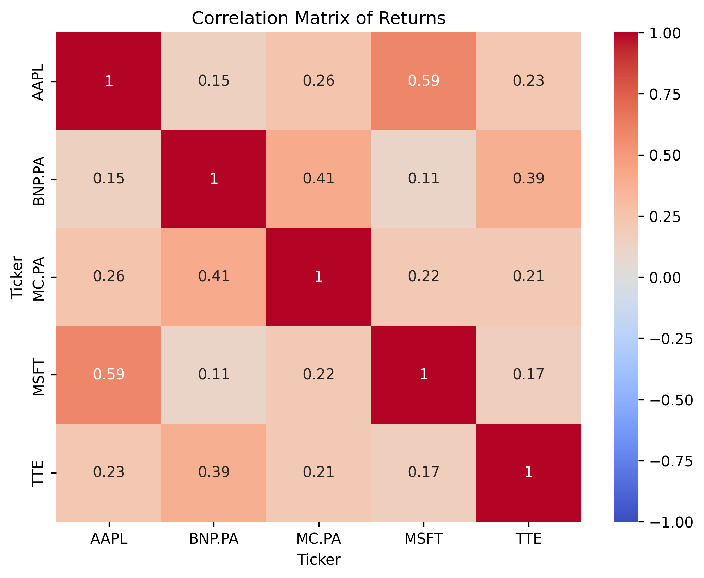

#  Portfolio Optimization with Monte Carlo Simulation

##  Overview

This project builds an optimal investment portfolio using **Monte Carlo simulation** and **Modern Portfolio Theory**.

We simulate 10,000 random portfolios and identify the allocation that **maximizes the Sharpe ratio**.  
The strategy is then evaluated through a **backtest against the S&P 500 benchmark**.

---

##  Key Results

###  Efficient Frontier



The efficient frontier represents the best achievable risk-return combinations.  
The black star corresponds to the portfolio with the **maximum Sharpe ratio**, offering the best trade-off between risk and return.

---

###  Optimal Portfolio Allocation



The optimal portfolio is mainly composed of **BNP.PA and TTE**, which provide strong risk-adjusted returns.  
Some assets receive minimal weights, indicating a limited contribution to performance.

---

###  Backtest vs Benchmark



The optimized portfolio slightly outperforms the **S&P 500** over the test period.  
This suggests that the allocation strategy captures attractive risk-return opportunities.

---

##  Methodology

The workflow follows a standard quantitative finance pipeline:

- Data collection (historical asset prices)
- Computation of returns
- Train/Test split (80% / 20%)
- Monte Carlo simulation of 10,000 portfolios
- Calculation of:
  - Expected return
  - Volatility
  - Sharpe ratio
- Selection of the optimal portfolio
- Backtesting against benchmark

---

##  Additional Insights

### Correlation Matrix



The correlation matrix highlights diversification opportunities between assets, a key driver of portfolio optimization.

---

##  Limitations

- No transaction costs included
- Static allocation (no rebalancing)
- Based on historical data only
- Potential overfitting

---

##  Tech Stack

- Python
- Pandas
- NumPy
- Matplotlib
- yfinance

---

## 📂 Project Structure

PROJET_FINANCE_QUANTITATIVE/
├── figure/                         # Generated visualizations and plots
│   ├── allocation.png              # Optimal asset weight distribution
│   ├── efficient_frontier.png      # Risk-return trade-off visualization
│   └── backtest.png                # Performance vs S&P 500 benchmark
├── .venv/                          # Python virtual environment (local)
├── finance_quantitative.ipynb      # Main analysis notebook (Data, Simulation, Results)
└── README.md                       # Project documentation and summary

---

## 🚀 How to Run

```bash
pip install -r requirements.txt